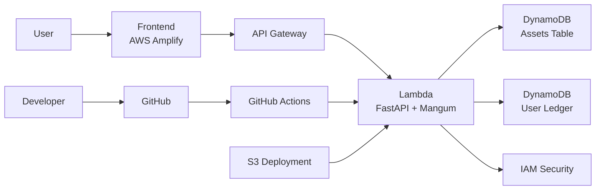

# 🧠 REX.LIBRARY — Serverless Digital Archive System

<p align="center">

[](https://main.d2f692z9x36m90.amplifyapp.com/)


</p>

---

## 🚀 Overview

**REX.LIBRARY** is an enterprise-grade **serverless digital archive and asset tracking system** built by **Chinmay V Chatradamath**.

It demonstrates a **full-stack cloud architecture**, combining a modern frontend dashboard with a scalable backend powered by AWS services.

This repository serves as a **system design showcase**, highlighting architecture, engineering decisions, and deployment strategy.

---

## 🎯 What This Repository Represents

This is a **complete system-level project**, showcasing:

* ⚙️ Backend architecture (FastAPI on AWS Lambda)
* 🎨 Frontend engineering (Tailwind + JavaScript dashboard)
* ☁️ Cloud infrastructure (AWS serverless stack)
* 🔐 Security design (IAM + controlled access)
* 🚀 CI/CD automation (GitHub Actions → AWS)

---

## 🧩 System Architecture Diagram



---

## ✨ Key Features

### 📦 Serverless Backend

* FastAPI deployed via AWS Lambda
* Auto-scaling, zero idle cost
* High-performance async API

---

### 🗄️ Advanced NoSQL Design

* Dual-table DynamoDB architecture:

  * **Assets Table** → Asset metadata & availability
  * **User Ledger** → Allocation relationships
* Atomic operations to prevent race conditions

---

### 🧠 Dual-State Frontend

#### ☁️ Cloud Mode

* Real-time AWS integration
* Persistent storage
* Architect-based identity system

#### 🧪 Sandbox Mode

* Local simulation using browser storage
* Zero-cost testing
* Instant UI feedback

---

### ⚙️ Middleware Engineering

* Handles API Gateway stage prefix (`/default`)
* Ensures consistent behavior across environments

---

### 🔄 Data Handling

* Custom serialization for DynamoDB `Decimal`
* Clean JSON output for frontend
* Prevents runtime errors

---

### 🎨 Cybernetic UI/UX

* Glassmorphism design (Tailwind CSS)
* Animated micro-interactions
* Shimmer loading states
* Lucide icon system

---

## 🛠 Tech Stack

### Backend

* FastAPI
* Mangum
* Boto3

### Cloud Infrastructure

* AWS Lambda
* API Gateway
* DynamoDB
* IAM

### Frontend

* HTML5
* Tailwind CSS
* JavaScript

### DevOps

* GitHub Actions (CI/CD)
* AWS Amplify
* Amazon S3

---

## 📂 Repository Structure (Conceptual)

```bash
rex-library/
│
├── frontend/        # UI (private repo)
├── backend/         # API (private repo)
└── README.md        # System showcase
```

---

## 🔗 Related Repositories

> 🔒 Private for security reasons

* Backend API (FastAPI + AWS Lambda)
* Frontend Dashboard (Tailwind UI + JS)

---

## 🔐 Repository Access

This repository is a **public system showcase only**.

The actual frontend and backend codebases are private due to security considerations.

Architecture and implementation details are shared at a high level for demonstration purposes.

---

## ⚙️ Engineering Highlights

* 🔐 IAM Least Privilege Security
* ⚡ Serverless scaling (0 → thousands of users)
* 🧠 System design focused (not just implementation)
* 🚀 Automated CI/CD pipeline
* 📊 Dual-environment architecture

---

## 🔮 Future Improvements

* 🔐 Role-based access control (RBAC)
* 📊 Advanced analytics dashboard
* 🔎 Smart search & filtering
* 📱 Mobile-first UI
* 🧠 AI-powered recommendations

---

## 👨‍💻 Author

**Chinmay V Chatradamath**

---

## ⭐ Final Note

This project demonstrates:

* ✅ Full-stack cloud engineering
* ✅ Serverless architecture
* ✅ Scalable NoSQL design
* ✅ Secure system design
* ✅ DevOps automation
